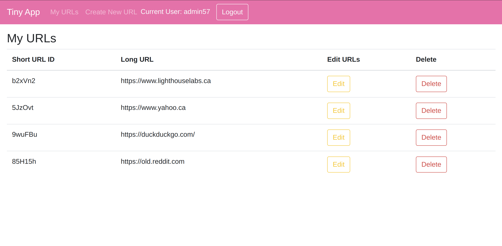
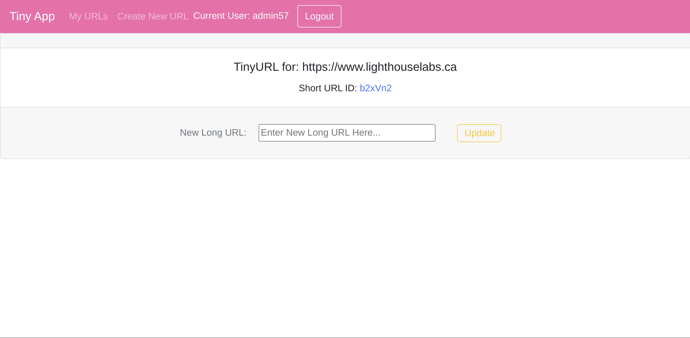

# TINY APP

## What is Tiny App?

This is a simple URL Shortener Web Service. A user can register their own account and login to it. Once logged in, they can create, read, update and delete URLs to a simulated (non-persistent) database. When a URL is added to the database, Tiny App will create a short URL for it, which you can use in place of the full URL.

This is a CRUD/BREAD web application that implements 15 endpoints, plus helper functions.

## Dependencies

**Technology Stack**: Node.js and Express.js

* Primary Dependencies:

  - Node.js: Standard JS backend framework.
  - Express.js: Backend server framework to write the backend API program.
  - EJS: To serves as the templating engine.
  - [cookie-session](https://github.com/expressjs/cookie-session): To parse and encrypt cookies client-side.
  - bcryptjs:  To provided encryption to `cookie-session`.
  - URLEncoded: To decode URL encoded data [built in to Express.js].

 

* Developer Dependencies:

  - Morgan: To provide logging (most notably, printing live information about requests and responses to console).
  - Nodemon: To auto-restart the program during debugging sessions.
  - Mocha + Chai: To assert and run tests.

## Getting Started

You can install the dependencies with these commands:

* Primary Dependencies: `npm install express ejs cookie-session bcryptjs`

* Developer Dependencies: `npm install nodemon morgan mocha chai --save-dev`

Lastly, you can run the development web server using the `npm start` command. If you want to run the regular version, you can do so with `node express_server.js`.

